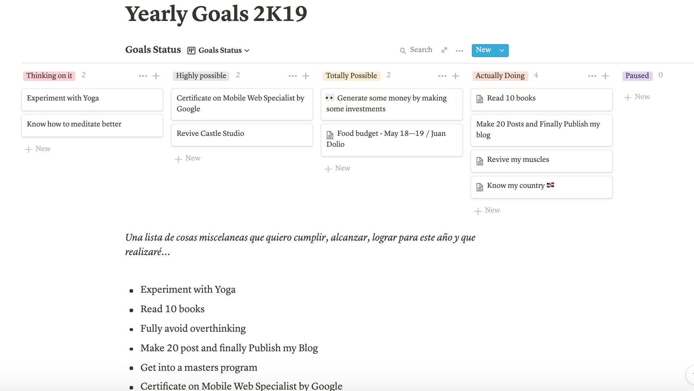

A principios de diciembre, cené con un compañero y empezamos a hablar de nuestros propósitos de Año Nuevo. Le dije que todos los años escribo una larga lista de cosas que intento lograr para el año.

> "Así que tus propósitos son como una lista de cosas por hacer", observó.

*Parte de mi enorme lista de cosas por hacer el año pasado*

> -  "Supongo que eso es cierto", dije. "¿Cuál es tu resolución?"

> - "Esto va a sonar medio ridiculo, pero mi resolución es ser más amable conmigo mismo", dijo.

Me quedé unos segundos pensando y exclamé:
> - "Ya veo, me gustó eso... esa es la vuelta".

Con el permiso de mi amigo, y consciente de que mi anterior enfoque de "lista de cosas por hacer" no había funcionado en ningún año anterior a éste, he sustituido mi letanía por este compromiso mucho más sucinto: Me esforzaré por ser amable conmigo mismo. Y recomendaría este objetivo a cualquiera que ya haya cometido un error en una resolución hecha en este Año Nuevo y considero que en algúna que otra cosa, todos fallamos en alguna de nuestras resoluciones.

Después de todo, ¿cuántos de nosotros hemos desperdiciado energías innecesarias en la autocrítica cuando no llegamos al gimnasio tan a menudo como quisiéramos, cuando dormimos hasta tarde el fin de semana, o cuando nos permitimos unas cuantas calorías extra? Todos podemos trabajar para establecer nuevos y más saludables hábitos en este nuevo a;o, pero aquí hay algunas maneras sencillas de poner el cuidado de sí mismo a la cabeza de tú lista.

## Abraza la autocompasión

La mayoría de nosotros, especialmente en esta época del año, nos fijamos en nuestros defectos. Pensamos en lo que aún tenemos que lograr, en lo que prometimos que terminaríamos pero no lo logramos o en aquello que juramos no hacer pero lo hicimos, en esas metas no cumplidas, en los libros no leídos y en las metas profesionales que aún no han sido superadas.

En lugar de concentrarte en lo que no has terminado, en lo que fallaste, mejor abraza la autocompasión, definida simplemente como tu capacidad de aceptar tus defectos con amabilidad y comprensión. Leí una frase celebre de *Kristen Neff* que decía...

> Tener compasión por ti mismo significa que honras y aceptas tu humanidad.

Las cosas no siempre saldrán como tú quieres. Te encontrarás con frustraciones, se producirán pérdidas, cometerás errores, te toparás con tus limitaciones, no alcanzarás tus objetivos. Esta es nuestra condición como humanos, una realidad compartida por todos nosotros.

Para averiguar cuán autocompasivo eres, pruebate a ti mismo usando la escala de autocompasión de Neff. Luego puede trabajar para aumentar su autocompasión usando algunos de los ejercicios disponibles en su sitio web.

## Calla al criticón que llevas dentro

Lo más probable es que estás muy familiarizado con tú crítica interna y su tendencia a menospreciarte: ella es la que te dice que no eres lo suficientemente delgado o inteligente. Si la dejas, te mantendrá despierto por la noche con una lista interminable de todas las cosas que hiciste mal ese día.

Pero resulta que callar tu crítica interior es bueno para tu salud mental. Las investigaciones demuestran que la autocompasión conduce a sentimientos de felicidad, optimismo y curiosidad que uno mismo se reporta.

Tal vez no sea posible silenciarla por completo, pero puedes comenzar a reconocer tu crítica interna cuando ella se comporta de manera inapropiada. Cambia el lenguaje que utiliza. En lugar de dejar que diga "eres perezoso", anímela a que le hable como usted le hablaría a un buen amigo: "¡Tuviste un día difícil y mereces descansar después del trabajo! Llegarás al gimnasio este fin de semana".

### Recuerda que eres imperfecto, y eso está perfectamente bien

## Sé amable con los demás

Un estudio reciente en la Universidad de California, Berkeley, encontró que los participantes que eran compasivos con los demás eran a su vez más compasivos con ellos mismos. Esto tiene sentido: Una vez que somos capaces de aceptar a los que nos rodean, es mucho más fácil aceptarnos a nosotros mismos.

"Si quieres que los demás sean felices, practica la compasión", dice el Dalai Lama. "Si quieres ser feliz, practica la compasión".

La investigación apoya el sentimiento del Dalai Lama: La bondad hacia los demás conduce a un mayor bienestar. ¿Quieres inspirarte? Echa un vistazo a la Fundación de Actos de Amabilidad al azar que tiene una lista de ideas de bondad para empezar.

## Date un permiso para ti

Después de Año Nuevo, mi compañero que tomó la resolución de ser más amable consigo mismo me envió una frase en La Dichosa Aplicación De Mensajería.

Recibí su nota una tarde en la que me sentí especialmente agotado y cansado, pero tratando de sobrellevar una tremenda gripe.

> - "Y que lo que, loco. ¿Fuiste amable contigo mismo hoy?" dijo.

Leí su nota, recordé mi resolución y sonreí. Entonces, y yo mismo me puse el permiso en Zoho (*chiste interno*) para irme a dormir.

Date estos permisos para ser bueno contigo mismo en este nuevo año. Si te sientes agotado, duermete. Si te sientes estresado, toma un descanso, baraja, chilea... sé más charlatán. Y si te sientes desanimado porque no has cumplido lo suficiente con tus resoluciones o metas, recuérdatelo amablemente: ***Tú eres suficiente***. También puedes darte un palo por si eres de esas personas drásticas.